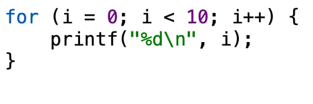
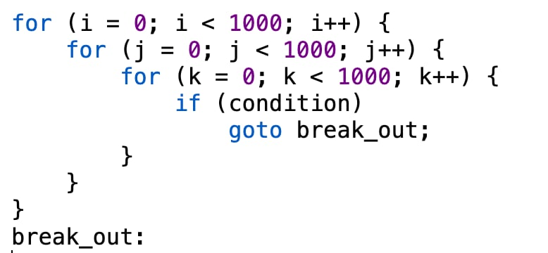

# CMSC 11 Commentary by Yeona Ellice L. Soleng  

When I first started learning C, loops were one of the first things that fascinated me. They looked simple at first, like a neat way to repeat actions without rewriting code, but the more I used them, the more I saw how deeply they reflected the logic and discipline behind programming. Every line had to make sense, every step had to connect. Nothing in C happens by accident, and its loops are proof of that.

Before loops and conditionals became standard, programmers used something called the goto statement to control how their programs flowed. It worked by sending the program directly to another labeled part of the code. It sounded simple enough, but in practice, it became a mess. People would use goto everywhere, jumping from one part of the code to another, until the whole thing looked like tangled spaghetti. That’s why “spaghetti code” became a real term in computer science. It was readable only to the person who wrote it, and even they would sometimes get lost trying to fix it later on.

Back then, programming languages didn’t have while loops, if statements, or functions the way we do now. Everything had to be built using goto, and while it got the job done, it wasn’t sustainable. It was too easy to make mistakes, and debugging became a nightmare. That’s why the early pioneers of computer science decided to rethink the way programs were written. They came up with the idea of structured programming, which encouraged using methods, loops, and conditionals instead of random jumps. It was a major shift in how people thought about code. Instead of chaos, there was order. Instead of uncontrolled jumps, there were clear, logical flows.

The for loop in C shows this idea perfectly. It has everything laid out in one line: the start, the condition, and the step. You can see where it begins and when it ends, and that gives you control. A simple loop like:

tells you everything you need to know in just a few characters. You know how many times it will run, what variable it uses, and what happens after every iteration. There’s no hidden logic or surprise. It’s a small example of how C makes you think clearly and stay aware of what’s happening behind the scenes.

That sense of structure is what makes C both strict and elegant. It doesn’t hold your hand, but it gives you the right tools if you’re willing to use them properly. The while and do-while loops show this too. They both repeat code, but in slightly different ways. The while loop checks the condition first, which means the code inside might not run at all if the condition is false. The do-while loop, on the other hand, runs the code first before checking. It’s a small difference, but it gives the programmer freedom to choose what fits their logic best.

Still, even though goto was the source of so many headaches, C didn’t completely get rid of it. Dennis Ritchie, the creator of C, understood that sometimes goto could actually make code cleaner if used carefully. For example, if you have several nested loops and need to exit them all at once, a single goto might make more sense than multiple break statements or condition checks. A situation like this is common:

In a case like this, goto isn’t bad. It’s just efficient. The real problem starts when people use it carelessly, jumping into random parts of code without thinking about how it affects everything else. That’s when programs become unpredictable. It’s like skipping to the middle of a book and expecting the story to still make sense.

A teacher once compared goto to a plane ticket that can take you anywhere, but when you arrive, you might not have your luggage. That image stuck with me. It’s funny, but it’s true. goto gives you power, but without structure, that power leads to confusion. You might reach your destination, but you’ll lose something important along the way—clarity, control, or even necessary cleanup steps in your code.

That’s why the structured loops in C feel so important. They bring discipline to what could easily become chaos. They show that programming isn’t just about making things work, but about making them understandable. When you use a for or while loop, you’re not only telling the computer what to do, you’re also explaining it to anyone who might read your code in the future, including yourself.

C’s loops also reflect how the language treats its programmers. It trusts you. It assumes you know what you’re doing, or that you’ll learn by breaking things first. It doesn’t stop you from making mistakes, but it gives you just enough structure to recover from them. You’re the one in control, and that’s both empowering and a little intimidating.

Compared to modern languages, C can feel harsh. In Python or JavaScript, you don’t have to think much about increments or conditions unless you want to. But that’s also what makes C so valuable to learn. It doesn’t hide the logic. You see every detail, every movement of the loop. You’re aware of how the program grows and repeats, step by step. It forces you to slow down and understand what’s really happening.

What I like most about C’s loops is that they teach responsibility. They make you realize that every action in a program should have a reason. You can’t just jump around and hope for the best. You have to plan your logic, set your limits, and know exactly when to stop. It’s the kind of habit that doesn’t just make you a better programmer, but also a more thoughtful thinker in general.

Even though programming has evolved so much, almost every modern language still follows the same looping structure that C introduced decades ago. The syntax might look cleaner, but the foundation is the same. That says a lot about how well the design worked. C’s loops weren’t just a convenience—they became a standard for how we think about repetition and control.

Looking back, I understand why goto was discouraged and why loops were such a breakthrough. It wasn’t just about making code cleaner. It was about teaching a way of thinking that balanced logic with order. In a way, learning loops in C is like learning discipline through repetition. You write, you test, you fail, and you fix. Each line is a small exercise in patience and clarity.

C doesn’t try to make programming easy. It tries to make it clear. Its loops are a reminder that clarity matters more than shortcuts, and that structure, when used right, gives freedom instead of taking it away. That’s what makes C timeless. It doesn’t just teach you how to code. It teaches you how to think.

